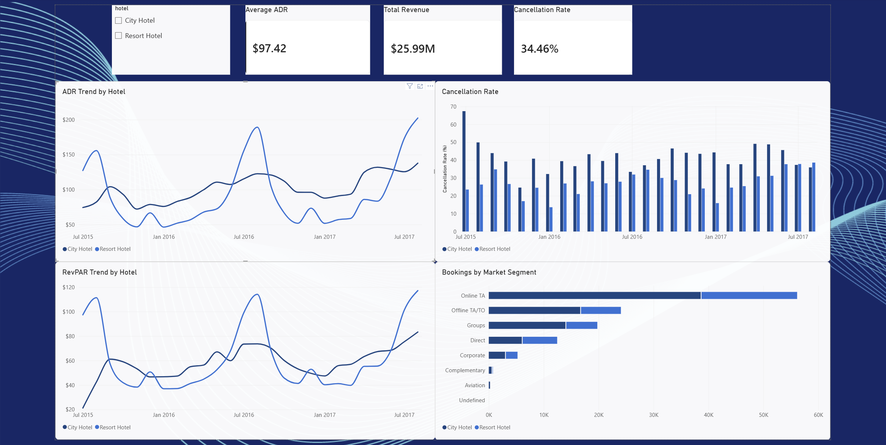

# Hotel Performance Dashboard

An interactive Power BI dashboard analyzing hotel performance across City Hotel and Resort Hotel properties.

## Overview

This project analyzes hotel booking data to identify trends in revenue, pricing, cancellations, and market segments. The dashboard allows users to filter by hotel type and compare performance over time.

## Key Metrics

- Average Daily Rate (ADR)
- Revenue per Available Room (RevPAR)
- Total Revenue
- Cancellation Rate
- Bookings by Market Segment

## Tools & Skills

- Power BI
- Power Query
- DAX
- Data Modeling
- Data Visualization
- KPI Analysis

## Dashboard Features

- Interactive hotel slicer
- ADR and RevPAR trend analysis
- Cancellation rate comparison
- Market segment breakdown
- KPI cards for ADR, revenue, and cancellation rate

## Data Source

The original dataset is the [Hotel Booking Demand dataset on Kaggle](https://www.kaggle.com/datasets/jessemostipak/hotel-booking-demand), published by Jesse Mostipak.

The `data` folder contains the original raw dataset along with cleaned and summarized CSV files created for this project.

### Processed Data
- `hotel_bookings_clean.csv` — cleaned booking-level data
- `kpi_monthly_summary.csv` — monthly hotel performance KPIs
- `country_summary.csv` — booking metrics summarized by country
- `segment_summary.csv` — booking metrics summarized by market segment
